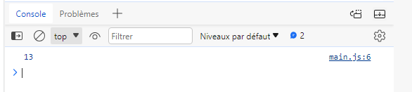

# Brief 0 - Comprendre l'algorithmie et corriger un code

## Ressource
[ressource](https://github.com/MessaliHadj/cdaMaif)

## Tâches

### Tâche 1 

#### Enoncé
A l'aide des boites de dialogue du navigateur, créez un console.log qui réalise l'addition de deux nombres entiers entrés par l'utilisateur.

#### Résolution
1 - Créer page index.html

2 - Lier le fichier javascript : 
```html
<!DOCTYPE html>
<html lang="en">
<head>
    <meta charset="UTF-8">
    <meta name="viewport" content="width=device-width, initial-scale=1.0">
    
    <title>Document</title>
</head>
<body>
    <h1>Hello</h1>
</body>
<script src="./main.js"></script>
</html>
```

3 - Modifier le type des nombres en type "number" avec l'instruction `parseInt` :

```js
var nombre1 = parseInt(prompt("Entrez un nombre entier"));
var nombre2 = parseInt(prompt("Entrez un autre nombre entier"));

console.log(nombre1 + nombre2);
```
4 - Afficher les devTools du navigateur pour visualiser la console, puis raffraichir la page



### Tâche 2 

#### Enoncé
Réalisez une fonction "nombrePair" qui affiche dans la console les nombres pairs de 0 à 100.

#### Résolution
Réalisation de la fonction et appel de la fonction:

```js
function nombrePair() {
  for (var i = 0; i <= 100; i++) {
    if (i % 2 == 0) {
      console.log(i);
    }
  }
}
nombrePair();
```

### Tâche 3 

#### Enoncé
Créez une fonction qui génère un nombre entre 0 et 1 dans la console.

#### Résolution
Réalisation de la fonction et appel de la fonction:

```js
function nombreAleatoire() {
  const nombre = Math.random(); // code manquant : il faut appeler la fonction Math.random()
  console.log(nombre);
  return nombre;
  
}
nombreAleatoire();
```

### Tâche 4 

#### Enoncé
Trouvez comment arrondir ce nombre et affichez le.

#### Résolution

Modifier la fonction précédente pour l'injecter comme paramètre de la fonction d'arrondi : 

```js
function nombreAleatoire() {
  const nombre = Math.random(); // code manquant : il faut appeler la fonction Math.random()
  console.log(nombre);
  return nombre;
  
}
const nombre = nombreAleatoire();
console.log(typeof(nombre));

// 4 - Trouvez comment arrondir ce nombre et affichez le.
function arrondirNombre(nombre) {
  var arrondi = Math.round(nombre); // code non fonctionnel : il faut passer le nombre en paramètre de la fonction Math.round()
  console.log(arrondi);
}

arrondirNombre(nombre);
```

### Tâche 5 

#### Enoncé
Générez un nombre entre 0 et 1000, demandez un chiffre à l'utilisateur et affichez dans la console si votre nombre est divisible par le chiffre de l'utilisateur.

#### Résolution

Math.floor permet d'arrondir à l'entier le plus proche. Math.random renvoie un nombre entre 0 et 1, il faut le multiplier par 1000 et l'arrondir pour avoir un nombre aléatoire entre 0 et 1000. On utilise le modulo pour connaitre si le nombre est divisible. 

```js
const nombre5 = Math.floor(Math.random() * 1000); 
const chiffre = prompt("Entrez un chiffre");
if (nombre5 % chiffre == 0) {
  console.log("Le nombre " + nombre5 + " est divisible par " + chiffre);
} else {
  console.log("Le nombre " + nombre5 + " n'est pas divisible par " + chiffre);
}
```

### Tâche 6 

#### Enoncé
Affichez une boîte "alert" lorsque l'utilisateur fait un clic droit.

#### Résolution

On pose un écouteur d'évènement sur le navigateur. Le comportement par défaut de l'évènement recharche la page; on l'empêche par l'instruction preventDefault() de l'évenement.

```js
window.addEventListener("contextmenu", function (e) {
  e.preventDefault(); 
  alert("Vous avez fait un clic droit");
});
```

### Tâche 7 

#### Enoncé
Changez la couleur du titre h1 au chargement de la page.

#### Résolution

On pose un écouteur d'évènement sur le chargement de la page. Puis on sélectionne la balise `<h1>` avec un `document.querySelector("h1")`, dont on modifie le style

```js
window.addEventListener("load", function () {
  var titre = document.querySelector("h1"); 
  titre.style.color = "red";
});
```
### Tâche 8

#### Enoncé
Faites une boucle qui affiche le contenu du tableau js "petitTableau1" dans la console

#### Résolution

Boucle for pour parcourir tous les éléments du tableau par leur index

```js
const petitTableau1 = ["un", "deux", "trois"];
for (let i = 0; i < petitTableau1.length; i++) {
  console.log(petitTableau1[i]);
}
```
### Tâche 9

#### Enoncé
Faites une boucle qui insère une <div> pour chaque item du tableau js "petitTableau2" avec son contenu à l'intérieur.

#### Résolution

Comme 8, en ajoutant les éléments du DOM

```js
const petitTableau2 = ["quatre", "cinq", "six"];
const body = document.body; //sélectionner l'élément body
for (let i = 0; i < petitTableau2.length; i++) {
  const div = document.createElement("div"); //créer un élément div
  div.textContent = petitTableau2[i]; //assigner le contenu du tableau à la propriété textContent du div
  body.appendChild(div); //ajouter le div au body
}
```
### Tâche 10

#### Enoncé
Créez une variable "grandTableau" et insérez y le contenu des deux petits tableaux précédents

#### Résolution

Concaténer les deux tableaux.

```js
const grandTableau = petitTableau1.concat(petitTableau2);
console.log(grandTableau);
```
